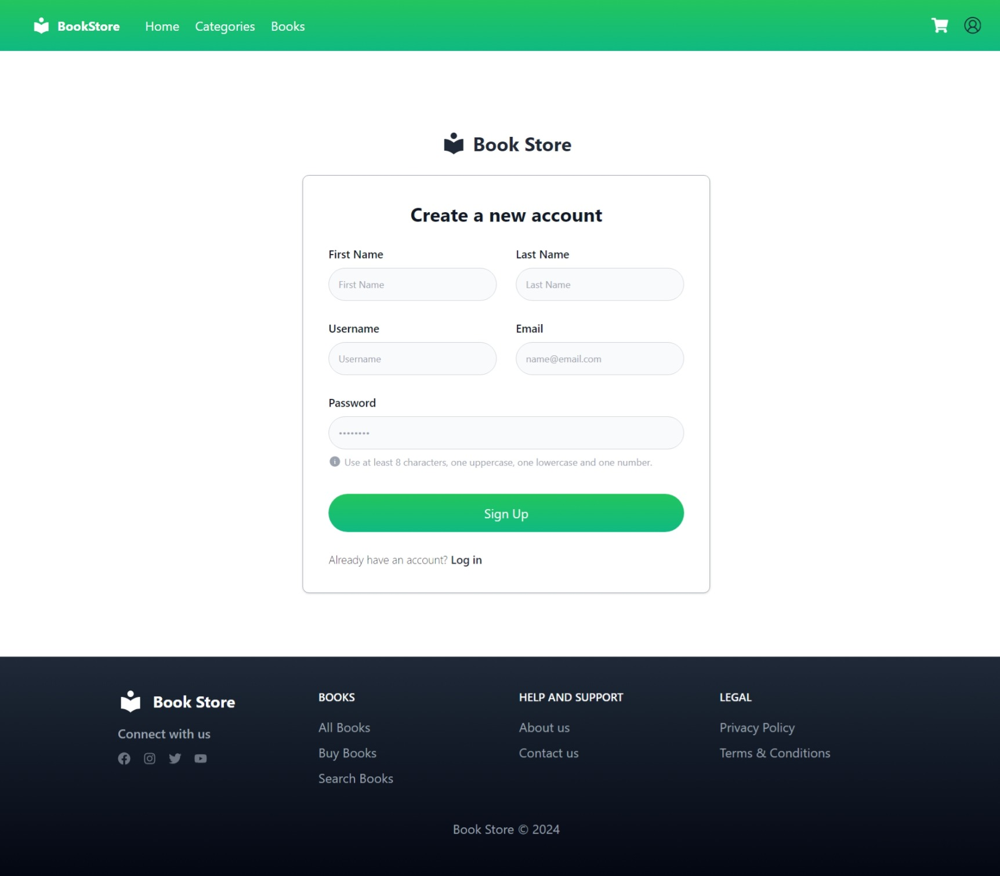
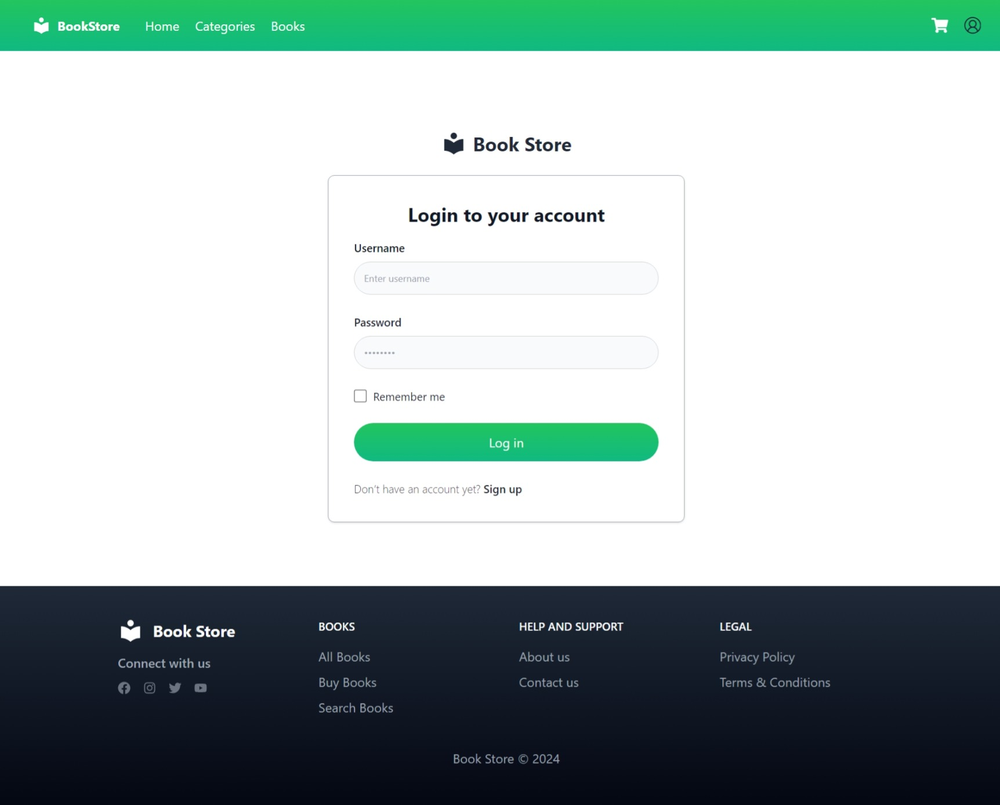
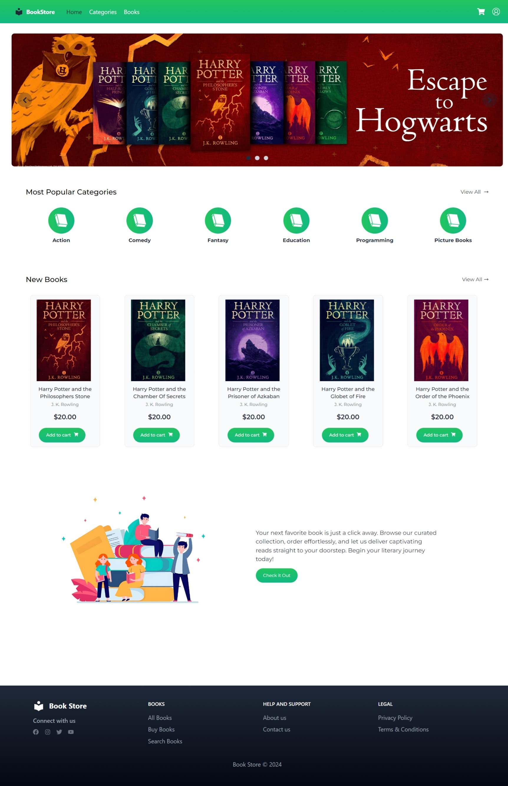
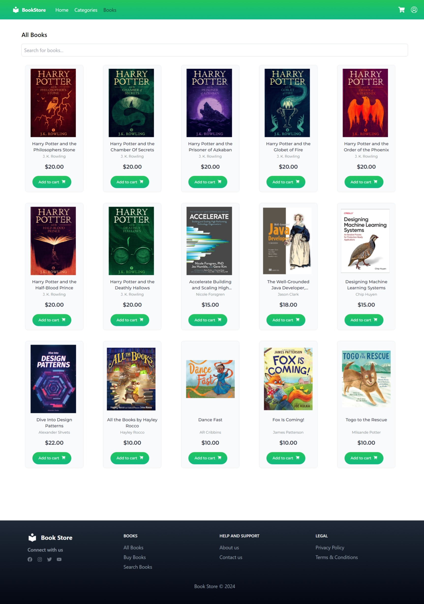
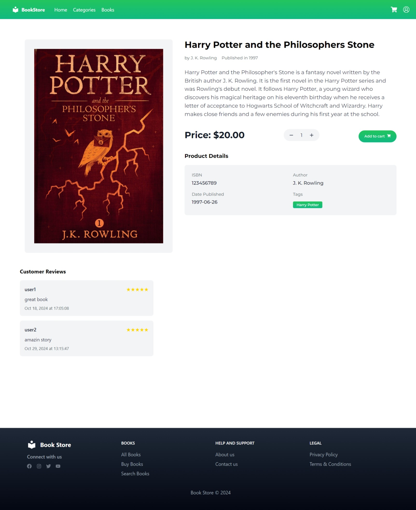
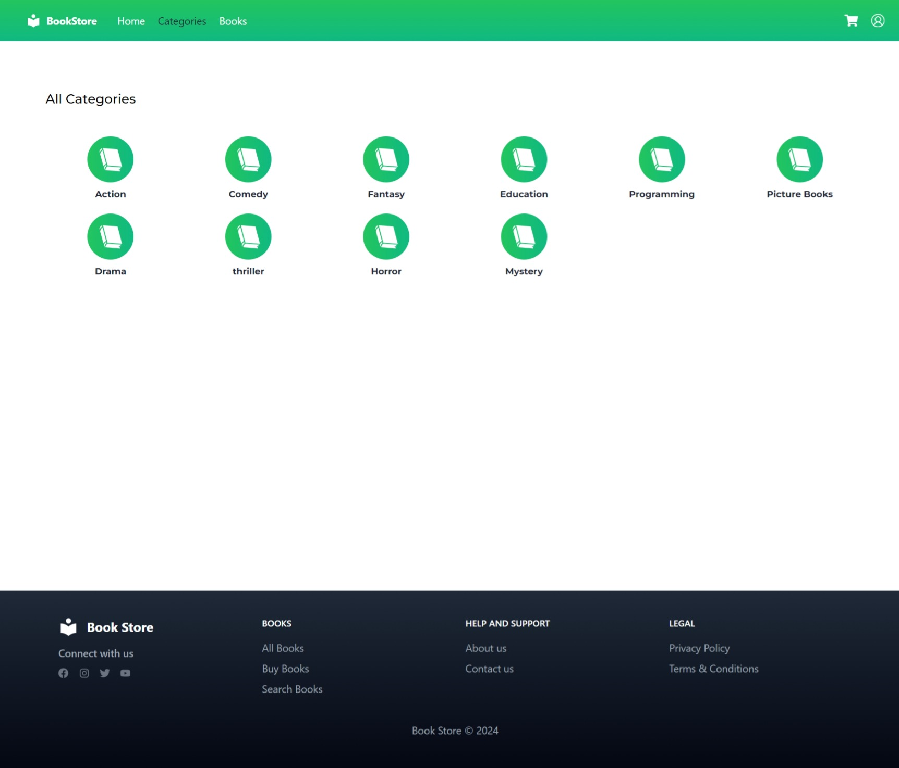
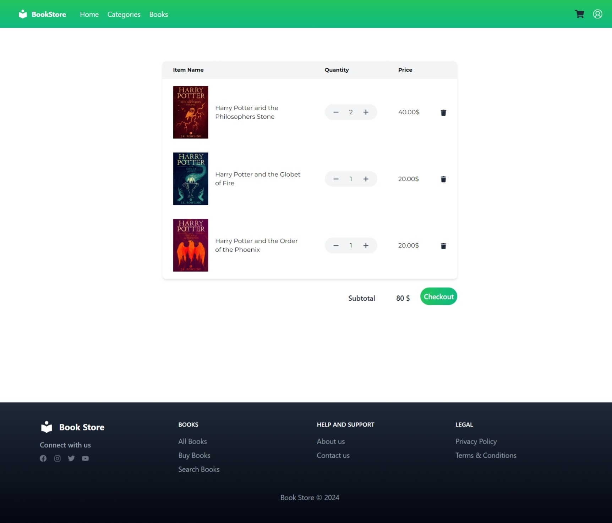
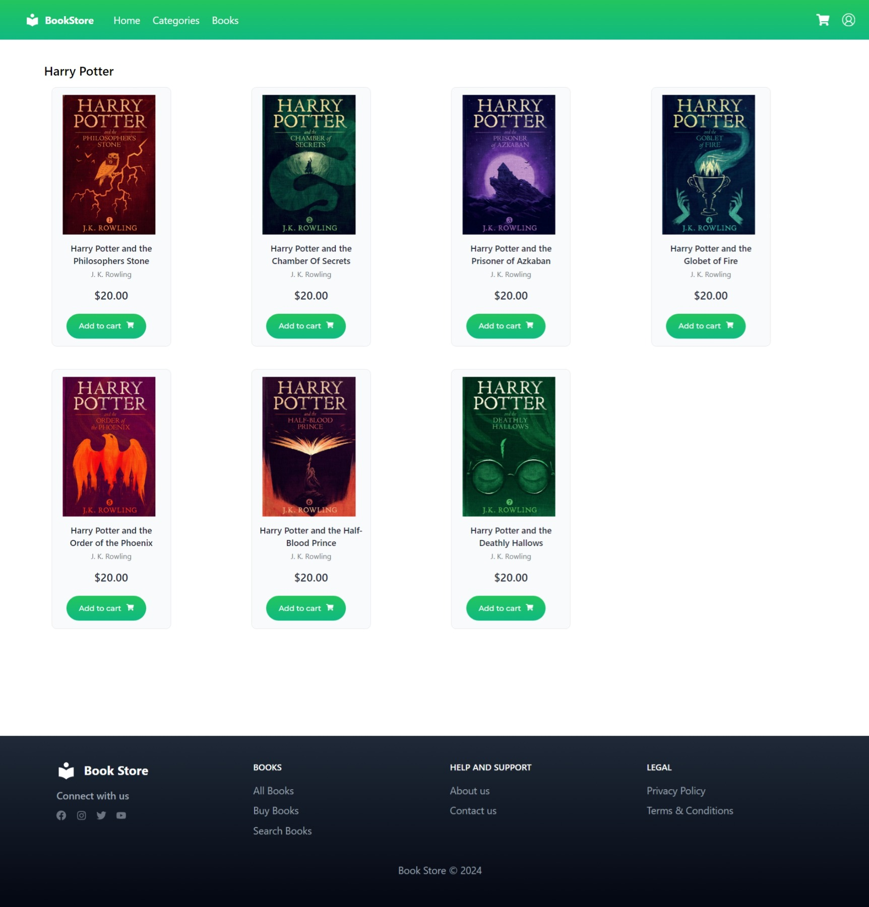

# Bookstore Application

The Bookstore Application is a full-stack web app developed to manage an online bookstore with a focus on a seamless user experience and a modern, responsive design. Built with a Django backend and a React frontend styled with Tailwind CSS, the app provides an intuitive and smooth interface for users and administrators alike.

## Project Overview

The Bookstore Application offers core functionalities for managing an online bookstore, including user authentication, customer management, a browsable catalog of books, and efficient order handling. The backend leverages Django and Django REST Framework (DRF) to handle secure data management and authentication, ensuring smooth user experiences and robust backend operations.

On the frontend, React powers an interactive and responsive interface, with Tailwind CSS providing a clean, modern design aesthetic that enhances usability across devices. This setup enables users to explore books by category or tag, manage their cart, and finalize orders with ease.

## Key Features

- **User Authentication**: JWT-based secure authentication, allowing users to register and log in seamlessly.
- **Customer Profile Management**: Users can maintain their profiles, add and remove shipping addresses, and view order history.
- **Catalog Browsing**: Books are displayed with easy-to-navigate categories and tags, allowing users to find what they need quickly.
- **Modern Cart and Order System**: Users can add items to their cart, view their cart, and proceed to checkout with just a few clicks.
- **Admin Controls**: Admins have access to add, update, or delete entries for books, customers, and orders, enabling full control over the store.

## Technologies Used

- **Backend**: Django, Django REST Framework (DRF), JWT Authentication
- **Frontend**: React, styled with Tailwind CSS for a modern and responsive design
- **State Management**: Axios for API interactions, React Router for seamless page transitions

## Screenshots

### Register Page

### Login Page

### Home Page

### Books Page

### Book Page

### Categories Page

### Cart Page

### Tag Page

## License

This project is open-source and licensed under the MIT License.
